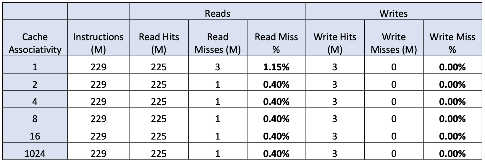
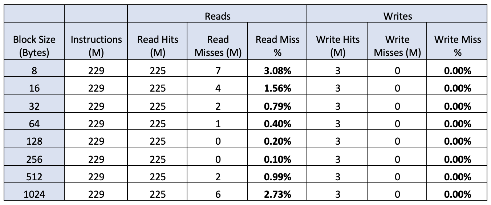
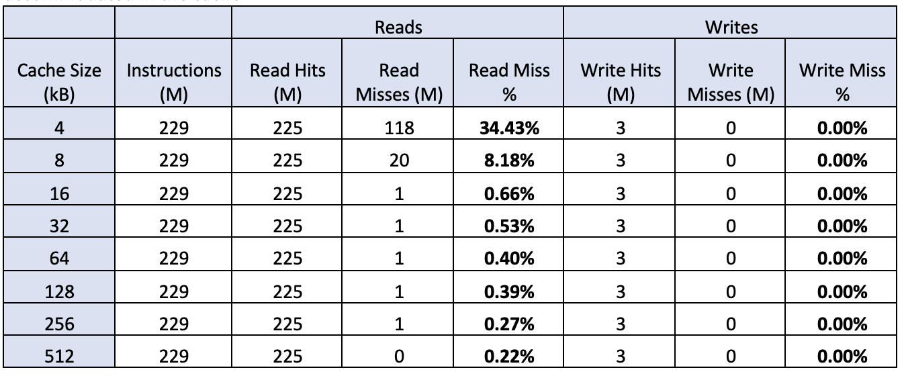
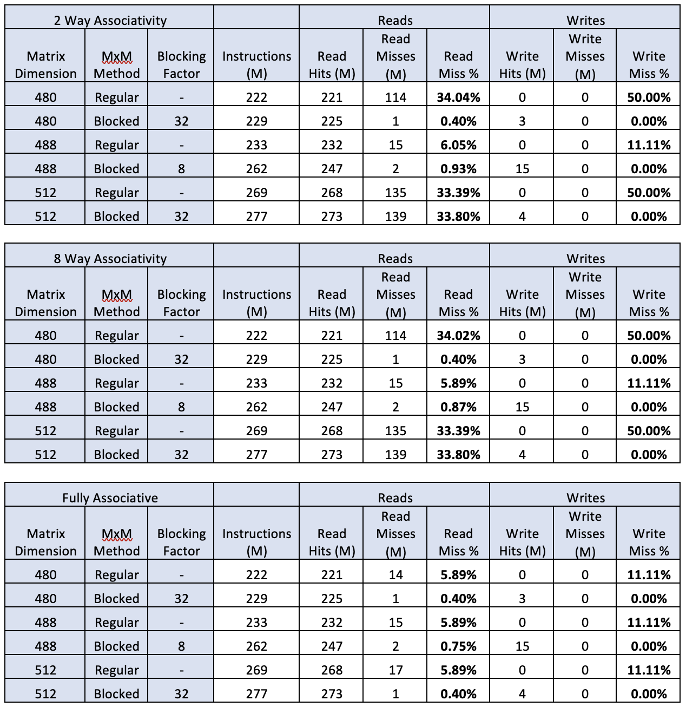
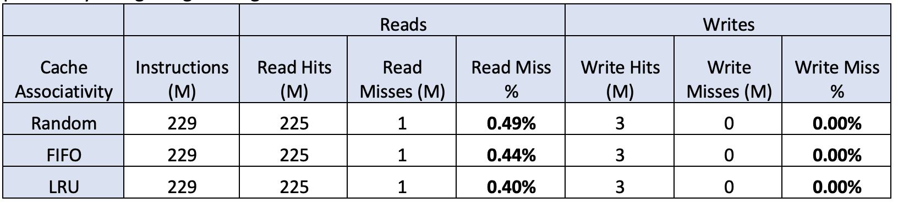

## Capabilities

1) Variable RAM Size
2) Variable Cache Size
3) Variable Block Size
4) Block Placement Strategy  
    a) Direct Mapped Cache  
    b) Fully associative Cache  
    c) N-way associative cache for arbitrary n  
5) Block Replacement Policy:  
    a) Random
    b) LRU
    c) FIFO
6) Write Policy – Write through with write allocate
7) Algorithms:  
    a) Daxpy
    b) MxM
    c) MxM_Block
8) CPU instructions for double precision floating point arithmetic:  
    (a) value3 = addDouble(value1, value2)
    (b) value3 = multDouble(value1, value2)
    (c) value = loadDouble(address)
    (d) storeDouble(address, value)

## Events

The program is monitoring the following events:  
1) Instruction Counts  
2) Read Hits  
3) Read Misses  
4) Write Hits  
5) Write Misses  

## Interface

The program is supporting the following command line options:
1) -c : The size of the cache in bytes (default: 65,536)
2) -b : The size of a data block in bytes (default: 64)
3) -n : The n-way associativity of the cache. -n 1 is a direct-mapped cache. (default: 2) •-r : The replacement policy. Can be random, FIFO, or LRU. (default: LRU)
4) -a : The algorithm to simulate. Can be daxpy (daxpy product), mxm (matrix-matrix multiplication), mxm block (mxm with blocking). (default: mxm block).
5) -d : The dimension of the algorithmic matrix (or vector) operation. -d 100 would result in a 100 ×100 matrix-matrix multiplication. (default: 480)
6) -p : Enables printing of the resulting “solution” matrix product or daxpy vector aYer the emulation is complete. Elements should be read in emulation mode (e.g., using your loadDouble method), so as to
assess if the emulator actually produced the correct solution.
7) -f : The blocking factor for use when using the blocked matrix multiplication algorithm. (default: 32)

## Associativity

The trend observed here is similar to what was expected. As the cache associativity increases, the miss% decreases till a certain point, post which further increment in the associativity doesn’t impact the miss%. This is because we are limited by the cache size and block size beyond that point, meaning that associativity is no longer the factor hindering the decrement in read miss %, but it is limited by the smallness of the block size and the cache size.

## Memory Block Size

Here, with increase in block size, the read miss% decreases because a larger block is being brought to the cache, and hence, more values are getting pushed in the cache in a single go and hence, the misses are decreasing. However, beyond a certain point, since many unnecessary values are getting pushed in the cache (because of huge block size), the miss rate increases again.

## Total Cache Size

Here, as expected, increasing the cache size decreases the miss rate because more number of values can be accommodated in the cache

## Problem Size and Cache Thrashing

1) For the first table, the read misses are increasing drastically because, for matrix of size 512, there is perfect conflict for cache between the two matrices, because the number of blocks are a multiple of the matrix dimension. Because of this conflict, each element of one matrix evicts the corresponding element of the other matrix from the cache. Hence, the drastic increase in read misses.
2) As explained in part1, because of perfect conflicts, the performance of blocked matrix is worse than that of the regular matrix. By the time the program returns to a value again, it is already evicted from the cache.
3) The performance for fully associative cache is increasing for blocked matrix multiplication because the conflicts are befer resolved as there is plenty of space for every element. Hence the elements don’t get evicted and we get the desired miss rates for blocked matrix.
4) Here cache performance can be enhanced by: a) Doing tiling of different size
b) Changing order of j and k while multiplying.

## Replacement Policy

Here, when replacing the blocks randomly, as expected, the read miss% is higher compared to FIFO and it is the least for LRU, because we are upda1ng the values in cache based on recency. Higher the recency, more the probability of it geang used again.

An example code for executing the executable is:  
./cache-sim -a mxm -d 512 -n 8  